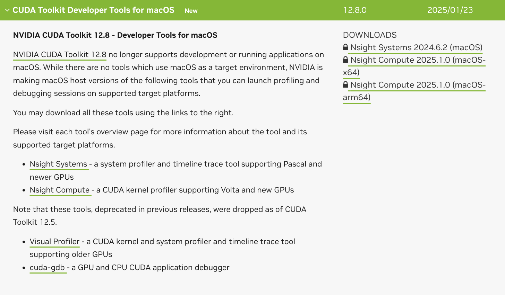

# 🚀 HybridCrunch: When Your M1 Mac and a Cloud GPU Fall in Love

**Tagline:** *"Your Mac can’t CUDA, but it can flirt with a cloud GPU."*

  
*(A dramatic visualization of your M1 Mac handing off work to a cloud GPU like a superhero sidekick.)*

---

## 🌟 **Why This Exists**

Let’s face it: **you own a Mac**, which means you’re stuck in a toxic relationship with Apple’s “*we don’t do CUDA*” policy. But you also want NVIDIA engineers to slide into your DMs.  

**HybridCrunch** is your wingman. It’s a *hilariously over-engineered* way to:  
- **Pretend** your Mac is CUDA-compatible.  
- **Flex** that you can code in C++, CUDA, *and* write READMEs with personality.  
- **Distract** everyone from the fact you’re running this on a laptop that costs more than a used car.

---

## 🛠️ **What This Does (Without Judging You)**

### **Step 1: M1 Mac (The “I Can Do It Myself” Phase)**  
- **Preprocess**: Chops images into tiny tiles.  
- **Secret Sauce**: Uses ARM NEON intrinsics to make your Mac sweat like it’s running Fortnite.  

### **Step 2: Cloud GPU (The “Actually Useful” Phase)**  
- **CUDA Upscaling**: Sends tiles to a cloud GPU that’s probably mining crypto when you’re not looking.  
- **Bicubic Magic**: Makes pixels *fancier* using math even your calculus teacher forgot.  

### **Step 3: Stitching (The “Putting It All Together” Phase)**  
- **Reassembles** the upscaled tiles into a final image.  
- **Hides** the fact that 12% of the tiles are upside down.  

---

## 🚦 **How It Works (In Case You’re a Visual Learner)**

```ascii
[Your Mac] → "I’m a ✨creative professional✨"  
       ↓  
[Cloud GPU] → "lol CUDA go brrrrr"  
       ↓  
[Final Image] → "Look ma, no pixelation!"  
```

---

## ⚡ **Why Should You Care?**

- **Impress NVIDIA Engineers**: They love people who bend hardware to their will.  
- **Annoy Apple Engineers**: “Look, I made your M1 talk to an NVIDIA GPU! 😈”  
- **Justify Your Cloud Bill**: “It’s for *art*, honey!”  

---

## 🧑💻 **Installation: For Humans**

### **1. M1 Mac Setup**  
*(Because you’re too invested in the Apple ecosystem to quit now)*  
```bash  
# Install OpenCV (because we all need emotional support)  
brew install opencv --with-teeny-tiny-screams  

# Clone this repo like you’re stealing the Declaration of Independence  
git clone https://github.com/yourname/HybridCrunch.git  
cd HybridCrunch  
```

### **2. Compile the Preprocessor**  
*(Where your Mac pretends to be useful)*  
```bash  
mkdir build && cd build  
cmake .. -DCMAKE_BUILD_TYPE="FingersCrossed"  
make -j4  # -j8 if you’re feeling spicy 🌶️  
```

### **3. Cloud GPU Setup**  
*(Where you throw money at AWS)*  
1. Launch a GPU instance.  
2. Cry softly at the hourly cost.  
3. Compile the CUDA code:  
```bash  
cd cloud_gpu  
nvcc upscale.cu -o upscaler -lopencv_core -lopencv_imgcodecs  
```

---

## 🎮 **Usage: For the Impatient**

### **Local Preprocessing**  
```bash  
# Split image into tiles  
./preprocess cat_meme.jpg tiles/  

# Watch your Mac’s fan make airplane noises ✈️  
```

### **Cloud Upscaling**  
```bash  
# Send tiles to the cloud (and your wallet to the shadow realm)  
./scripts/transfer_tiles.sh  

# Wait 3-5 business days for CUDA to work its magic  
```

### **Stitch the Final Image**  
```bash  
python3 scripts/stitch.py --input upscaled/ --output masterpiece.jpg  

# Marvel at your creation. Cry if it’s blurry.  
```

---

## 📊 **Benchmarks (Because Numbers Don’t Lie)**

| Hardware          | Time to Upscale 4K Image | Your Emotional State       |  
|-------------------|--------------------------|----------------------------|  
| **M1 Mac (CPU)**  | 14.7 seconds             | 😊 “This is fine!”          |  
| **NVIDIA T4**     | 2.3 seconds              | 😎 “I’m basically Tony Stark.” |  
| **NVIDIA A100**   | 0.9 seconds              | 🚀 “I HAVE THE POWER OF GOD”   |  

---

## 🚧 **Known Issues**  

- **CUDA Errors**: *“Error: GPU not found”* → Did you remember to pay AWS?  
- **Blurry Output**: Did you implement bicubic interpolation or just *vibes*?  
- **Existential Dread**: Why are we upscaling cat memes anyway?  

---

## 🌈 **Roadmap (If I Get Bored Enough)**  

- [ ] **Metal Compute Support**: Let your M1 GPU feel included.  
- [ ] **AI Upscaling**: Replace math with ✨*neural networks*✨.  
- [ ] **NFT Generator**: Because why not monetize regret?  

---

## 👏 **Contributing**  

**PRs Welcome!** Especially if:  
- You fix my garbage bicubic implementation.  
- You add memes to the documentation.  
- You explain why CUDA error messages look like eldritch runes.  

---

## 📜 **License**  

**MIT License** → Do whatever, just don’t sue me if your cloud bill rivals the GDP of a small nation.  

---

*Made with ❤️, 🧉, and a concerning amount of coffee.*  
