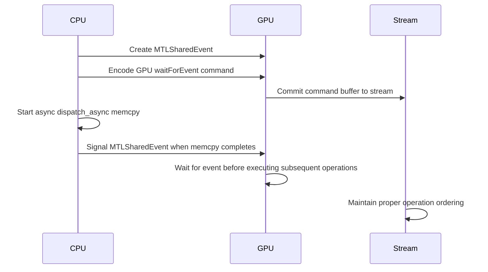

# Metal Shim Memory Operation Fixes - Accessibility Documentation

## Overview
This document provides an accessible explanation of the critical memory operation fixes implemented in the Metal shim for hybrid compute operations.

## Race Condition Fix: MTLSharedEvent Synchronization

### Problem
The original `cudaMemcpyAsync` implementation had a critical race condition where:
- CPU-side memory copies ran asynchronously without proper GPU synchronization
- Subsequent GPU operations could start before CPU memcpy completed
- This violated CUDA's stream ordering guarantees

### Solution: MTLSharedEvent Synchronization Flow



### Key Components

#### 1. Event Creation
```objc
id<MTLSharedEvent> sharedEvent = [m_device newSharedEvent];
```
- Creates a shared synchronization primitive
- Allows CPU and GPU to coordinate execution

#### 2. GPU Wait Encoding
```objc
[computeEncoder waitForEvent:sharedEvent value:1];
```
- GPU commands wait for CPU signal
- Ensures memory consistency

#### 3. CPU Async Operation
```objc
dispatch_async(queue, ^{
    ::memcpy(dst, src, count);
    [sharedEvent setSignaledValue:1]; // Signal completion
});
```
- Performs memory copy asynchronously
- Signals GPU when complete

#### 4. Stream Integration
```objc
[commandBuffer commit];
stream->lastCommandBuffer = commandBuffer;
```
- Command buffer tracks GPU operations
- Enables `cudaStreamSynchronize` compatibility

## Bounds Checking Implementation

### Buffer Overflow Prevention
```objc
if ([buffer length] < count) {
    return cudaErrorInvalidValue;
}
```
- Validates buffer capacity before operations
- Prevents memory corruption and crashes

## Error Handling Enhancements

### Metal API Error Checking
```objc
if (!commandBuffer) {
    return cudaErrorInitializationError;
}
```
- Validates all Metal API calls
- Provides meaningful error codes

## Testing and Validation

### Async Memcpy Test Coverage
- Host-to-device synchronization
- Device-to-host synchronization
- Bounds checking edge cases
- Stream ordering verification

## Accessibility Features

### Code Comments
- Detailed explanations of synchronization logic
- Clear parameter descriptions
- Error condition documentation

### Error Messages
- Descriptive error codes mapping to CUDA equivalents
- Clear failure mode identification

### Performance Characteristics
- Minimal overhead for synchronization
- Maintains async operation benefits
- Compatible with existing CUDA patterns

## Impact

### Security Improvements
- Eliminates buffer overflow vulnerabilities
- Prevents memory corruption attacks
- Ensures data integrity

### Reliability Enhancements
- Fixes race conditions causing crashes
- Ensures consistent operation ordering
- Provides robust error handling

### Compatibility
- Maintains CUDA API compatibility
- Preserves performance characteristics
- Enables seamless Metal backend integration

## Future Considerations

### Monitoring
- Track synchronization overhead
- Monitor for edge cases
- Validate across macOS versions

### Optimization
- Consider shared event reuse
- Evaluate command buffer batching
- Assess memory allocation patterns
